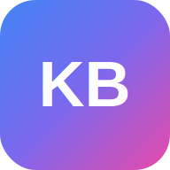

<p align="center">
  
</p>

<h1 align="center">KodingBuddy</h1>

<p align="center">
  <strong>Belajar Coding Jadi Seru!</strong><br/>
  AI Chatbot asisten produktivitas untuk belajar pemrograman dan teknologi, <em>powered by Google Gemini AI</em>.
</p>

<p align="center">
  <a href="#fitur-utama">Fitur</a> &bull;
  <a href="#tech-stack">Tech Stack</a> &bull;
  <a href="#getting-started">Getting Started</a> &bull;
  <a href="#penggunaan-api-key">API Key</a> &bull;
  <a href="#tentang-proyek">Tentang Proyek</a>
</p>

---

## Tentang Proyek

**KodingBuddy** adalah chatbot AI yang dirancang sebagai **asisten produktivitas belajar** khususnya di bidang pemrograman dan teknologi. Aplikasi ini dibuat sebagai **Final Project** dari program **"AI Productivity and AI API Integration for Developers"** — bagian dari inisiatif [AI Opportunity Fund: Asia Pacific](https://hacktiv8.com/projects/avpn-asia) yang diselenggarakan oleh **Hacktiv8** bekerja sama dengan **AVPN**, **Google.org**, dan **Asian Development Bank**.

> **Wave 3 (March) — Batch 7**

### Mengapa KodingBuddy?

Belajar coding bisa terasa overwhelming — banyak bahasa, framework, dan konsep yang harus dipahami. KodingBuddy hadir sebagai teman belajar AI yang:

- **Sabar dan suportif** — menjelaskan dari nol tanpa menghakimi level pemula
- **Adaptif** — bisa membantu dari HTML dasar hingga system design
- **Interaktif** — mendukung input teks, gambar, audio, dan dokumen
- **Berbahasa Indonesia** — menggunakan Bahasa Indonesia sebagai bahasa utama dengan istilah teknis tetap dalam bahasa Inggris

### Use Case

Chatbot ini menggunakan model Google Gemini (LLM) dengan konfigurasi system instruction khusus sebagai **coding tutor** yang mengajarkan pemrograman secara bertahap, menggunakan analogi sederhana, dan mendorong praktik langsung. Cocok untuk:

- Belajar bahasa pemrograman (JavaScript, Python, Go, Rust, Java, dll.)
- Memahami framework (React, Next.js, Express, Django, Laravel, dll.)
- Debugging kode dengan penjelasan langkah demi langkah
- Review kode dan best practices
- Konsep CS fundamental hingga system design

---

## Fitur Utama

### Multi-Model Support
Pilih dari beberapa model Gemini sesuai kebutuhan — mulai dari yang cepat dan hemat kuota hingga yang paling canggih. Setiap model menampilkan informasi context window, max output tokens, dan rate limit.

| Model | Keunggulan |
|---|---|
| Gemini 2.5 Flash | Balance terbaik — cepat dan hemat kuota |
| Gemini 2.5 Flash-Lite | Tercepat — ideal untuk pertanyaan ringan |
| Gemini 2.5 Pro | Terpintar — untuk masalah kompleks |
| Gemini 3.1 Pro (Preview) | Deep Think — penalaran paling mendalam |
| Gemini 3 Flash (Preview) | Next-gen Flash — cepat dengan kemampuan baru |

### Thinking Mode
Model yang mendukung fitur thinking akan menampilkan **proses berpikir** sebelum memberikan jawaban. Bisa di-toggle on/off melalui badge di atas input chat.

### Google Search Grounding
Aktifkan fitur search untuk memberikan Gemini akses ke Google Search secara real-time. Hasil pencarian ditampilkan sebagai sumber referensi yang bisa diklik.

### Multimodal Input
- **Gambar** — Upload atau paste gambar langsung, preview dengan lightbox
- **Audio** — Upload file audio atau rekam langsung dari browser dengan visualisasi waveform real-time
- **Dokumen** — Upload PDF, TXT, CSV, dan file kode. PDF memiliki preview khusus

### Streaming & Typing Animation
Respons ditampilkan secara real-time melalui Server-Sent Events (SSE) dengan efek typing animation yang adaptif — lambat untuk respons pendek, cepat untuk respons panjang.

### Markdown Rendering
Respons AI di-render sebagai Markdown lengkap dengan syntax highlighting untuk code blocks, tabel, dan tombol copy-to-clipboard.

### Conversation Management
- Riwayat percakapan tersimpan di browser (localStorage)
- Auto-title generation menggunakan AI
- Grup berdasarkan waktu (Hari Ini, Kemarin, 7 Hari Terakhir, Lebih Lama)
- Rename, hapus, atau export percakapan sebagai Markdown
- Export semua percakapan sekaligus dalam format ZIP

### Retry with Variants
Tidak puas dengan jawaban? Klik retry untuk mendapatkan respons alternatif. Semua varian tersimpan dan bisa di-navigasi.

### Custom API Key
Gunakan API key Gemini pribadi untuk akses lebih banyak model dan kuota. Key divalidasi secara server-side dan model yang tersedia otomatis ditemukan. **Key tidak disimpan di server**.

### Konfigurasi Model Parameters
Atur **Temperature**, **Top K**, dan **Top P** sesuai preferensi melalui Settings dialog.

### Dark Mode
Tema gelap dan terang dengan transisi halus.

### Bilingual (ID/EN)
Tersedia dalam Bahasa Indonesia dan English. Bisa diganti kapan saja melalui language switcher di header.

### Progressive Web App (PWA)
Bisa di-install sebagai aplikasi native di desktop atau mobile melalui browser.

---

## Tech Stack

| Layer | Teknologi |
|---|---|
| Framework | **Next.js 16** (App Router, Turbopack) |
| UI | **React 19**, **shadcn/ui**, **Tailwind CSS v4**, **Framer Motion** |
| AI | **Google Gemini API** (`@google/genai` SDK) |
| State | **Zustand** (with localStorage persistence) |
| i18n | **next-intl** |
| Markdown | **react-markdown**, **remark-gfm**, **rehype-highlight** |
| Theming | **next-themes** (class-based, oklch color space) |
| Export | **jszip**, **file-saver** |
| Language | **TypeScript** |

---

## Getting Started

### Prerequisites

- [Bun](https://bun.sh/) (recommended) atau Node.js 18+
- Google Gemini API Key — dapatkan gratis di [Google AI Studio](https://aistudio.google.com/apikey)

### Installation

```bash
# Clone repository
git clone https://github.com/MSayib/hacktiv8-task-project.git
cd hacktiv8-task-project

# Install dependencies
bun install

# Setup environment
cp .env.example .env.local
# Edit .env.local dan masukkan GEMINI_API_KEY
```

### Environment Variables

```env
GEMINI_API_KEY=your_gemini_api_key_here
```

### Development

```bash
bun run dev
```

Buka [http://localhost:3000](http://localhost:3000) di browser.

### Build

```bash
bun run build
bun run start
```

---

## Penggunaan API Key

> **Penting untuk pengguna demo / publik:**
>
> Aplikasi ini menggunakan **API key sistem (free tier)** yang memiliki batas penggunaan (rate limit) dari Google. Jika Anda mengalami error `429 — Rate limit exceeded` atau chatbot tidak merespons, kemungkinan besar **kuota harian atau per menit sudah tercapai**.
>
> Mohon maklum jika sewaktu-waktu API tidak berfungsi karena rate limit. Ini adalah keterbatasan dari free tier Google Gemini API.

### Solusi: Gunakan API Key Pribadi

Untuk pengalaman terbaik dan kuota sendiri, Anda bisa menggunakan **API key pribadi**:

1. Buka [Google AI Studio](https://aistudio.google.com/apikey) dan buat API key gratis
2. Di aplikasi, buka **Settings** > tab **Gemini API Key**
3. Aktifkan toggle, masukkan API key, dan klik **Simpan**
4. Aplikasi akan otomatis memvalidasi dan menemukan semua model yang tersedia di akun Anda

API key pribadi **tidak disimpan di server** dan **hilang saat tab browser ditutup**.

### Rate Limit (Free Tier)

| Model | RPM | RPD | TPM |
|---|---|---|---|
| Gemini 2.5 Flash | 10 | 250 | 250K |
| Gemini 2.5 Flash-Lite | 15 | 1,000 | 250K |
| Gemini 2.5 Pro | 5 | 100 | 250K |
| Gemini 3.1 Pro (Preview) | 5 | 100 | 250K |
| Gemini 3 Flash (Preview) | 10 | 250 | 250K |

*RPM = Request per Menit, RPD = Request per Hari, TPM = Token per Menit*

---

## Struktur Proyek

```
src/
├── app/
│   ├── api/
│   │   ├── chat/          # Streaming chat endpoint (SSE)
│   │   ├── title/         # Auto-generate conversation title
│   │   ├── upload/        # File upload (multer, base64)
│   │   └── validate-key/  # API key validation & model discovery
│   ├── layout.tsx         # Root layout, metadata, PWA
│   └── page.tsx           # Main application page
├── components/
│   ├── chat/              # Chat UI (input, messages, toggles, modals)
│   ├── layout/            # Header, theme toggle, about dialog
│   ├── settings/          # Settings, model selector, language switcher
│   ├── sidebar/           # Conversation list & management
│   └── ui/                # shadcn/ui base components
├── hooks/                 # Custom hooks (audio recorder, streaming text)
├── i18n/                  # Internationalization (id.json, en.json)
├── lib/                   # Constants, utilities, AI providers
├── providers/             # Theme, i18n, tooltip providers
├── stores/                # Zustand stores (chat, settings, UI)
└── types/                 # TypeScript type definitions
```

---

## Deployment

Aplikasi di-deploy menggunakan **Vercel** dengan auto-deploy dari GitHub. CI pipeline menjalankan lint, type check, dan build pada setiap push.

---

## Kredit

Dibuat oleh **[Sayib](https://github.com/msayib)** sebagai Final Project program **AI Productivity and AI API Integration for Developers** — Wave 3 (March), Batch 7.

Program ini merupakan bagian dari [AI Opportunity Fund: Asia Pacific](https://hacktiv8.com/projects/avpn-asia) yang diselenggarakan oleh **Hacktiv8** bekerja sama dengan **AVPN**, **Google.org**, dan **Asian Development Bank**.

---

<p align="center">
  <sub>Powered by Google Gemini AI</sub>
</p>
